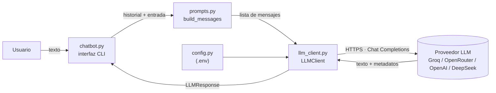

# Actividad 01 — Chatbot con LLM

> **Versión 1 del Asistente del Curso de IA:** `Usuario → LLM`

## Objetivo

Al finalizar, podrás usar un LLM como **componente de una aplicación de software**:
consumirlo mediante una API, controlar su comportamiento con mensajes y parámetros,
aislar el proveedor del resto del código y convertir su salida en datos que el programa
pueda validar y usar.

Ya sabes qué ocurre *dentro* de un Transformer. Esta semana lo trataremos como una
caja negra accesible por HTTP y nos concentraremos en lo que ocurre *alrededor*.

## Arquitectura



| Archivo         | Responsabilidad                                                | Qué aprenderás                                                        |
|-----------------|----------------------------------------------------------------|-----------------------------------------------------------------------|
| `config.py`     | Leer `.env` y producir un objeto `Settings`                    | Separar configuración y secretos del código                          |
| `llm_client.py` | Único módulo que habla con el proveedor                        | Anatomía de una llamada a un LLM y de su respuesta; aislar dependencias |
| `prompts.py`    | Prompts y construcción de la lista de mensajes                 | Roles `system` / `user` / `assistant`; el prompt como artefacto de diseño |
| `chatbot.py`    | Interfaz de consola y bucle de conversación                    | La API no tiene estado: el historial lo mantiene la aplicación       |
| `structured.py` | Pedir JSON y validarlo con un esquema                          | Convertir texto generado en datos confiables                         |

**Regla de dependencias:** solo `llm_client.py` importa `openai`. Si mañana cambiamos de
SDK o de proveedor, solo cambia ese archivo (y el `.env`).

## Qué conocemos

- Un LLM es un Transformer (decoder) entrenado para predecir el siguiente token.
- Tokenización, ventana de contexto, muestreo y temperatura (a nivel conceptual).
- Programación en Python y consumo básico de APIs.

## Conceptos nuevos

1. **API de un LLM** (Chat Completions): una petición HTTP con mensajes y parámetros.
2. **Roles de mensajes**: `system` (instrucciones), `user` (entrada), `assistant` (respuestas previas).
3. **Parámetros del modelo**: `model`, `temperature`, `max_tokens`.
4. **Respuesta del modelo**: texto + metadatos (`finish_reason`, uso de tokens).
5. **Separación aplicación / proveedor** y configuración mediante variables de entorno.
6. **Salida estructurada**: JSON + validación con esquema (Pydantic).

## Preparación

Desde la raíz del repositorio:

```bash
uv sync
cp .env.example .env        # PowerShell: Copy-Item .env.example .env
```

1. Crea una API key en alguno de estos proveedores:

   | `LLM_PROVIDER` | Dónde obtener la clave                                   | Costo     | Modelo de ejemplo                        |
   |----------------|----------------------------------------------------------|-----------|------------------------------------------|
   | `groq`         | [Groq](https://console.groq.com/keys) (recomendado)       | gratuito  | `llama-3.3-70b-versatile`                |
   | `openrouter`   | [OpenRouter](https://openrouter.ai/keys)                  | gratuito  | `meta-llama/llama-3.3-70b-instruct:free` |
   | `openai`       | [OpenAI](https://platform.openai.com/api-keys)            | de pago   | `gpt-4.1-mini`                           |
   | `deepseek`     | [DeepSeek](https://platform.deepseek.com/api_keys)        | de pago   | `deepseek-chat`                          |

2. Edita `.env`: pon el proveedor en `LLM_PROVIDER`, la clave en `LLM_API_KEY` y verifica que
   `LLM_MODEL` exista en la lista de modelos de ese proveedor.

> Los cuatro exponen la misma API (Chat Completions). Cambiar de proveedor no toca el código:
> solo cambian URL base (en `config.py`), clave y modelo (en `.env`).

Dependencias usadas y por qué:

| Paquete         | Para qué                                                                   |
|-----------------|----------------------------------------------------------------------------|
| `openai`        | Cliente para cualquier API compatible con Chat Completions (Groq, OpenRouter, OpenAI, DeepSeek) |
| `python-dotenv` | Cargar `.env` en variables de entorno                                      |
| `pydantic`      | Validar la salida estructurada                                             |

### ¿Qué hay debajo del SDK?

Antes de escribir código, observa que una llamada a un LLM es solo una petición HTTP
(Bash; reemplaza `$LLM_API_KEY` por tu clave o expórtala):

```bash
curl https://api.groq.com/openai/v1/chat/completions \
  -H "Authorization: Bearer $LLM_API_KEY" \
  -H "Content-Type: application/json" \
  -d '{
        "model": "llama-3.3-70b-versatile",
        "messages": [
          {"role": "system", "content": "Responde en una frase."},
          {"role": "user", "content": "¿Qué es la atención en un Transformer?"}
        ],
        "temperature": 0.3
      }'
```

Identifica en el JSON de respuesta: `choices[0].message.content`, `finish_reason` y `usage`.
El SDK `openai` solo construye esta petición y convierte la respuesta en objetos Python.

## Desarrollo

Todos los comandos se ejecutan desde la raíz del repositorio. Los puntos a completar están
marcados con `TODO` en el código.

### Paso 1 — Primera llamada al LLM (`llm_client.py`, TODO 1 y 2)

Implementa `LLMClient.chat`. Luego ejecuta la prueba de humo del módulo:

```bash
uv run python labs/01-llm/llm_client.py
```

Deberías ver un `LLMResponse(text=..., model=..., finish_reason='stop', ...)`.

### Paso 2 — Construir los mensajes (`prompts.py`, TODO 3)

Implementa `build_messages`. Ejecuta el chatbot en modo depuración para ver exactamente
lo que recibe el modelo:

```bash
uv run python labs/01-llm/chatbot.py --debug
```

### Paso 3 — Diseñar el prompt de sistema (`prompts.py`, TODO 4)

Con el prompt genérico (`"Eres un asistente útil."`) pregunta:
*"¿Cuándo es el primer parcial del curso?"* y anota la respuesta.
Después escribe un `SYSTEM_PROMPT` que cumpla los requisitos del TODO y repite la pregunta.

### Paso 4 — Historial de conversación (`chatbot.py`, TODO 5)

Sin completar el TODO, conversa dos turnos y pregunta *"¿Qué te pregunté antes?"*.
Luego completa el TODO y repite. Observa en `--debug` cómo crece la lista de mensajes
y el número de tokens de entrada.

### Paso 5 — Parámetros del modelo

Sin modificar el código, cambia valores en `.env` y compara:

- `LLM_TEMPERATURE=0` frente a `LLM_TEMPERATURE=1.2`: haz la misma pregunta creativa
  (p. ej., *"Propón un nombre para este asistente"*) tres veces con cada valor.
- `LLM_MAX_TOKENS=30`: haz una pregunta que requiera una respuesta larga y observa
  `finish_reason` en modo `--debug`.

### Paso 6 — Salida estructurada (`structured.py`, TODO 6)

Implementa el parseo y la validación, y ejecuta:

```bash
uv run python labs/01-llm/structured.py "¿Qué es el mecanismo de atención?"
```

### Paso 7 — Cambiar de proveedor

Crea una clave en el otro proveedor, cambia `LLM_PROVIDER`, `LLM_API_KEY` y `LLM_MODEL`
en `.env` y ejecuta de nuevo el chatbot. **No debes modificar ningún archivo `.py`.**

## Pruebas

| # | Prueba | Comando / entrada | Resultado esperado |
|---|--------|-------------------|--------------------|
| 1 | Llamada básica | `llm_client.py` | Se imprime un `LLMResponse` con `finish_reason='stop'` y tokens > 0 |
| 2 | Rol `system` | Pregunta *"¿Cuándo es el primer parcial?"* | Con tu prompt, el asistente indica que no tiene esa información y no inventa una fecha |
| 3 | Historial | *"Explica qué es el positional encoding"* → *"Dame un ejemplo de eso"* | La segunda respuesta se refiere al positional encoding; tras `/reiniciar` ya no hay contexto |
| 4 | Límite de tokens | `LLM_MAX_TOKENS=30` + pregunta larga en `--debug` | Respuesta truncada y `finish_reason=length` |
| 5 | Salida estructurada (conocimiento general) | `structured.py "¿Qué es el mecanismo de atención?"` | Objeto validado con `requiere_documentos_del_curso: false` |
| 6 | Salida estructurada (información del curso) | `structured.py "¿Qué temas entran en el parcial?"` | Objeto validado con `requiere_documentos_del_curso: true` |
| 7 | Configuración ausente | Deja vacío `LLM_API_KEY` y ejecuta el chatbot | Mensaje claro indicando que falta la clave (no un error del SDK) |
| 8 | Cambio de proveedor | Paso 7 | El chatbot funciona sin modificar código |

## Preguntas de análisis

Responde con tus palabras, apoyándote en lo que observaste (salidas, `--debug`, tokens).

1. **Estado.** La API no recuerda conversaciones anteriores. ¿Dónde vive entonces la
   "memoria" del chatbot? ¿Qué le ocurre al costo y a la latencia a medida que la
   conversación crece? ¿Qué pasaría al superar la ventana de contexto del modelo?
2. **Roles.** ¿Qué diferencia práctica observaste entre poner una instrucción en el mensaje
   `system` y ponerla en el mensaje `user`? ¿Puede un usuario contradecir el prompt de
   sistema? Prueba e informa.
3. **Temperatura.** Relaciona lo observado en el Paso 5 con el muestreo de tokens que
   estudiaste en Transformers. ¿Qué temperatura usarías para `structured.py` y por qué?
4. **`finish_reason`.** ¿Por qué una aplicación debería revisar este campo antes de mostrar
   o procesar la respuesta?
5. **Separación de responsabilidades.** ¿Qué archivos cambiarías si mañana el curso
   decidiera usar un modelo local o el SDK nativo de otro proveedor? ¿Qué ventaja tiene que
   `chatbot.py` capture `LLMError` y no `openai.APIError`?
6. **Salida estructurada.** El LLM generó el JSON, pero ¿quién garantiza que sea válido?
   ¿Qué haría la aplicación si `dificultad` llegara como `"media"`? ¿Por qué es útil separar
   `json.loads` de `model_validate`?
7. **LLM vs. software tradicional.** Para cada archivo de la actividad, indica si su
   comportamiento es determinista o probabilístico, y qué parte del sistema corresponde
   al LLM y cuál al software tradicional.
8. **Límite de esta versión.** En la prueba 2 el asistente no pudo responder sobre el
   parcial. ¿Por qué el modelo no puede saberlo, aunque sea muy grande? ¿Qué componente
   haría falta agregar para que sí pudiera responder correctamente?

## Evidencias

Entrega un documento breve (PDF o Markdown) que incluya:

1. Enlace a tu repositorio o archivo `.zip` con el código completo (**sin el archivo `.env`**).
2. Tu `SYSTEM_PROMPT` final y una comparación antes/después de la prueba 2.
3. Capturas o transcripciones de las pruebas 1 a 8 (en la prueba 3, incluye la salida de `--debug`).
4. Tabla con los resultados del Paso 5 (temperatura y `max_tokens`).
5. Respuestas a las preguntas de análisis.

## Reto opcional

Elige uno:

- **Proveedor falso para pruebas.** Crea un `FakeLLMClient` con el mismo método `chat` que
  devuelva respuestas predefinidas, y selecciónalo con `LLM_PROVIDER=fake`. Escribe una prueba
  con `pytest` para `build_messages` y otra para `analyze_question` sin llamar a ninguna API.
  ¿Qué te permitió hacer la separación entre aplicación y proveedor?
- **Reintento ante salida inválida.** Si `structured.py` recibe un JSON inválido, reenvía la
  petición incluyendo el mensaje de error de validación y pide al modelo que lo corrija
  (máximo dos reintentos).
- **Streaming.** Muestra la respuesta del chatbot token a token usando `stream=True`.
  ¿Qué cambia en `LLMClient` y qué cambia en la interfaz?
